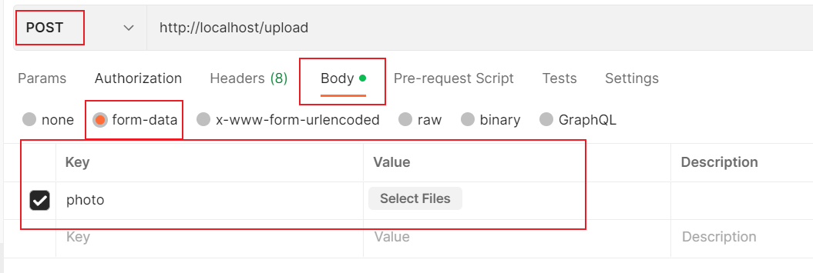
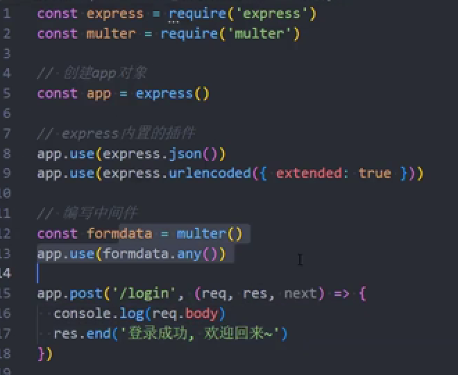
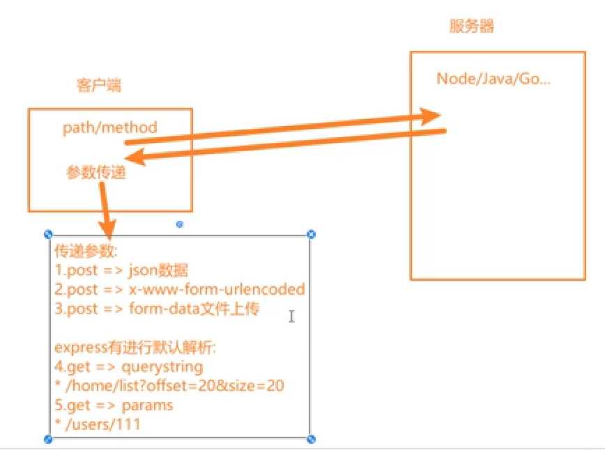

文件描述符 fd:在操作系统上，每个进程内核都维护着一张当前打开的文件和资源的表格
每个打开的文件都会被分配到一个数字类型的 fd，作为身份的标识

==文件写入和选项参数的使用==
使用 flag:"a"写入文件的话，会追加在文件末尾
使用 flag:"w"是覆盖原来的内容
不写的话，默认是 w 操作

可以把 buffer 看成一个存储二进制的数组，数组的每一项可以存储一个字节

既然已经有了 fs.readFile 和 fs.writeFile 为什么还要有流呢？
是为了更加精准的控制在文件的哪一个位置进行读取。

所有的流都是 EventEmitter 的实例

Websocket 是一种在单个 TCP 连接上进行全双工通信的协议。它允许在客户端和服务器之间进行实时数据传输，而无需进行轮询或长轮询。
Websocket 协议通过在 HTTP 握手期间升级连接来启用。
在建立连接后，客户端和服务器可以通过发送消息进行通信。Websocket 协议是 HTML5 规范的一部分，可以在现代浏览器中使用。

在可写流当中使用 flag：a 或者 a+是表示将写入的数据追加到文件后面
如果想要做到在指定位置写入数据，在 windows 电脑上必须是 flag 为 r+才能写入

```
const writeStream=fs.createWriteStream('./ddd.txt',{
    flag:'r+',
    start:6
})
```

## 第二天

1. 服务端开启一个服务，客户端发送请求，服务器要做出什么响应，代码应该写在 createServer 里面的回调函数里

2. 监听端口时，监听 1024 以上的端口，65535 以下的端口
   端口号由两个字节组成，一个字节可以表示 256 种结果，因此 256\*256=65536
   也就是 0~65535 的结果

3. 当我们修改了服务器的数据之后希望能够自动将服务器关掉再启动起来。
   使用 node xxxx 这样是不行的，因为服务器只是开启了一个新的进程
   下载一个 nodemon

4. 使用 postman 的话解析数据没有指定使用什么解码，默认是 utf-8
   而复制网址到浏览器是乱码，因为没有指定什么解码

那么要怎么设置呢？
需要设置返回的数字类型和数据的编码格式

```js
// 1.方式一：单独设置某一个header,数据的类型是json类型
res.setHeader("Content-Type", "application/json;charset=utf-8;");
// 数据的类型是文本类型
res.setHeader("Content-Type", "text/plain;charset=utf-8");

// 2.方式二：和响应状态码一起设置
res.writeHead(200, {
  "Content-Type": "application/json;charset=utf-8;",
});
```

5. axios 框架既能在客户端使用，也能在 node 中使用
   axios 在客户端中使用，底层 axios 是用的 XHR 或者 fetch
   axios 在 node 当中使用，底层是用的 http 模块

6. 使用 http 模块来发送 get，post 请求
   http.get()

const req=http.post(
{
method:"POST"
})
req.end()

7. 文件上传测试
   使用文件上传的时候，都得是 post 请求。在 postman 当中需要配置好 body,body 选择 form-data，文件类型是什么，然后选择类型 file/text
   

当点击 send，请求体里面的文件全部都会上传到服务器当中

怎么在服务器端查看
客户端传过来的数据都是在 req.on('data',(data)=>{console.log(data)})当中可以查看到

8. 什么是中间件
   中间件的本质是传递给 express 的一个回调函数
   app.post('/login',回调函数=>中间件)

## 第三天

1. 如果当前中间件没有结束请求，就必须调用 next()传递给下一个中间件功能
2. app.use()注册的中间件无论是什么请求都能匹配上
   当 express 接收到客户端的一个请求时，就会在所有中间件当中进行匹配，当匹配到第一个符合要求的中间件时，那么就会执行这个中间件
   后续的中间件是否会执行呢？取决于上一个中间件有没有 next()
3. 客户端发送过来的请求永远会和第一个普通中间件匹配上（这个很重要）
   如果有调用 next(),才会去找符合要求的下一个
4. app.use(express.json())
   直接使用里面已经做好对客户端传递过来的数据进行 JSON.parse 的解析，怎么拿到数据呢？req.body
   详细看 06-node 服务器-express 里面的 06 案例练习
5. 请求日志记录,使用第三方中间件 morgen

```js
const express = require("express");
const fs = require("fs");
const morgan = require("morgan");
// 创建中间件
const app = express();

// 应用第三方中间件
const writeStream = fs.createWriteStream("./logs/access.log");
app.use(morgan("combined", { stream: writeStream }));
// 编写中间件
app.post("/login", (req, res, next) => {});

// 启动服务器
app.listen("9000", () => {
  console.log("服务器启动成功~");
});
```

6. 使用 formdata 做解析（理解）,formdata 主要是用于文件上传的解析，不适用于普通数据的解析
   

7. 客户端发送请求的方式解析
   
8. 服务器返回客户端数据的方式
   1. res.end(),使用较少
   2. res.json()，传入的数据都会以 json 数据返回，可以传 object，array，string,boolean,number,null 等
9. express 部署静态资源：app.use(express.static('./xxx'))
   可以将其他项目做好打包的 build 文件夹拿过来目录下，使用 express 部署成静态资源，可以在浏览器当中运行，直接 http://localhost:9000 就可以了（因为没有跟其他路径的情况下会去找静态资源服务的内容里面的 index.html 文件夹）
10. 服务器发生错误的时候会返回给客户端一个错误的信息，有两种方案

    1. 方案一：返回 http 错误码，res.status(201),res.json("未授权访问的信息")
    2. 方案二：http 状态码 200，信息中包含错误的内容
       res.json({
       code:-1001,
       message:"未授权访问的信息"
       })

11. 将数据解析成 json 格式：app.use(express.json()) const body=req.body
12. 服务器发送给客户端的错误处理信息中：可以使用 next()来传递参数，这样就能做到错误的处理信息放在一个地方正确的放在一个地方,next()当中可以用来传递错误信息，详细见 06/15

```js
const express = require("express");

// 创建中间件
const app = express();

app.use(express.json());

// 对错误信息的处理使用的是方案二：自定义错误码
app.post("/login", (req, res, next) => {
  const { username, password } = req.body;
  if (!username || !password) {
    next(-1001);
  } else if (username !== "coderwhy" || password !== "123456") {
    next(-1002);
  } else {
    res.json({
      code: 0,
      message: "登陆成功，欢迎回来",
      token: "fsji7382hqwhe2wdw",
    });
  }
});

app.use((err, req, res, next) => {
  const code = err;
  let message = "未知的错误信息";

  switch (code) {
    case -1001:
      message = "没有输入用户名和密码";
      break;
    case -1002:
      message = "输入的用户名或密码错误";
      break;
  }

  res.json({ code, message });
});

// 启动服务器
app.listen("9000", () => {
  console.log("服务器启动成功~");
});
```

### koa 框架的学习

- koa 框架是通过 const app=new Koa()
- koa 框架的中间件是传入两个参数 app.use((ctx,next)=>{})
- 给客户端返回数据是使用 ctx.body="xxx"而不是 res.end("xxx")
- 获取用户传递过来的信息使用 ctx.request.body
- koa 通过创建的 app 对象，注册中间件只能通过 use 的方式，不能使用 app.get，那么怎么来区分文件传入的路径呢？通过 ctx.url="xxx"的方式。
- koa 使用路由需要额外下载，npm install @koa/router
- 每次创建完路由都加上这一个，这样用户使用不存在的请求方式的时候不是返回 not found 而是 methods not allowed，提示一个明确的信息
  app.use(userRouter.allowedMethods());
- 要想在 koa 中写 get，post，patch，delete 等操作，可以使用路由的方式
- multer：用来实现单文件或多文件上传，koa 和 express 用法类似
- koa 实现部署静态资源服务器，下载 koa-static
- koa 当中的 next 只是用来执行下一个中间件，不能像 express 那样传递错误码参数
- koa 中错误处理的方法：在独立的文件写错误码的处理。使用的文件 ctx.app.emit 发出一个事件，独立文件接收 on,注意发出事件传递了三个参数，还把 ctx 也传出去了，这样错误处理文件就能直接解决

```js
userRouter.get("/", (ctx, next) => {
  let isAuth = false;
  if (isAuth) {
    ctx.body = "登陆成功，欢迎回来~";
  } else {
    // ctx.body = {
    //   code: -1001,
    //   message: "登录失败，未授权",
    // };

    // EventEmitter
    ctx.app.emit("error", -1001, ctx);
  }
});

// 独立的文件：error-handle.js
app.on("error", (code, ctx) => {
  const errCode = code;
  let message = "";
  switch (errCode) {
    case -1001:
      message = "账号错误";
      break;
    case -1002:
      break;
    case -1003:
      break;
  }

  const body = {
    errCode,
    message,
  };
  ctx.body = body;
});
```

注意使用代码调试的时候就不能使用 nodemon 来执行了，而是由调试器来开启服务器
